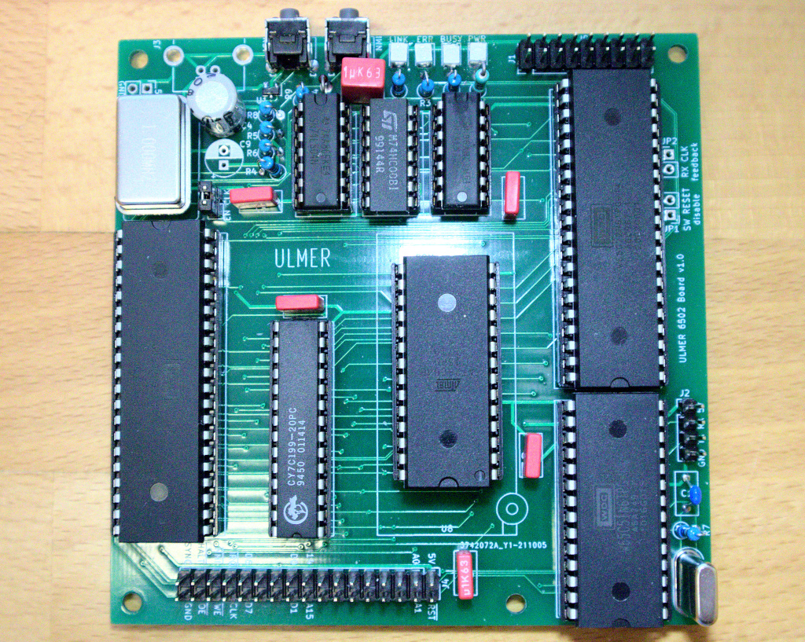

# Homebrew 6502 computer

This repo contains kicad schematics, netlist, layout and gerber plots for the pcb,
as well as a parts list and the firmware (basic features are working, but it's
still under development). All parts are new and readily available as of Dec '21.
This board and all it's software have been developed using only open-source tools.

You are welcome to use everything contained in this repository under the
terms of the GNU General Public License v3.0.



Check out more info on this project [on my website](https://www.aulmer.at/6502.html).

## Specifications

* 65c02 8-bit CPU along with 32KB RAM and 8K ROM
* 65c22 VIA provides some GPIO pins and timers
* 65c51 ACIA provides a serial port with up to 115200 baud
* 4 status led's
* 18 pin I/O pinheader with general purpose I/O pins (VIA)
* 34 pin expansion pinheader exposing full address and data bus
as well as other interesting lines (`SYNC`, `CLK` and `HALT`)

## Firmware

The firmware is currently under development but already provides
`getchar()` and `putchar()` functions to nicely interact with any
device attached to the serial port. these are implemented fully
asynchronously.

## Memory map and I/O addresses

```plaintext
+-----------------------+   <- 0x0000     --.
|       zeropage        |                   |
+-----------------------+   <- 0x0100       |
|        stack          |                   |
+-----------------------+   <- 0x0200       |
|      available        |                   |
|         RAM           |                    > 32k RAM
|         ...           |                   |
+-----------------------+   <- 0x7e00       |
|     UART RX buffer    |                   |
+-----------------------+   <- 0x7f00       |
|     UART TX buffer    |                   |
+-----------------------+   <- 0x8000     --'
|                       |
|      unallocated      |         reserved for expansion shields etc.
|                       |
+-----------------------+   <- 0xdfe0     --.
|      65C51 UART       |                   |
+-----------------------+   <- 0xdff0        > memory mapped I/O
|      65C22 VIA        |                   |
+-----------------------+   <- 0xe000     --:
|     firmware code     |                   |
|    firmware rodata    |                   |
|                       |                    > 8k ROM
+-----------------------+   <- 0xfffa       |
|        vectors        |                   |
+-----------------------+   <- 0xffff     --'
```
