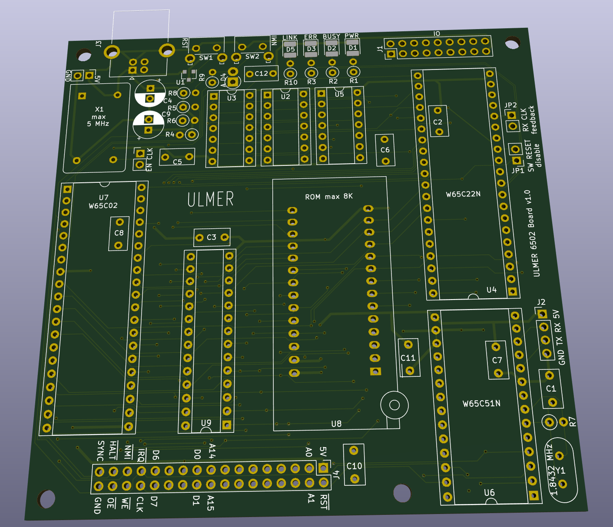

# Homebrew 6502 computer

This repo contains schematics for the PCB, a parts list and
the firmware/monitor program.



## Specifications
### CPU and memory
* W65C02 8-bit CPU
* 32KB of on-board SRAM
* 8KB of on-board EEPROM

### Onboard I/O
* W65C51N ACIA UART chip (max baud rate 19200)
* W65C22N I/O chip
    * 12 general purpose I/O pins
    * serial shift register
    * software reset bit (can be disabled)
* Software reset

### Ports and headers
* USB A-type power supply
* 18 pin I/O pinheader with general purpose I/O pins
* 34 pin expansion pinheader exposing full address and data bus
as well as other interesting lines
* `SYNC`, `CLK` and `HALT` signals are fed to the expansion pinheader
so that a hardware debugger may be implemented

## Memory map and I/O addresses
```
0x0000 - 0x7fff   32K   RAM
0x8000 - 0xdfdf  ~24K   reserved for future use
0xdfe0 - 0xdfef   16B   W65C51N UART controller
0xdff0 - 0xdfff   16B   W65C22N VIA I/O controller
0xe000 - 0xffff    8K   ROM (readonly)
```

## Special registers

### Software RESET
The whole board can be reset by writing a zero into bit 3
of the VIA's port B, when data direction is set to output.
Note that any RAM will not be cleared.

### Onboard LED's
LED's are mapped to PB0-PB2 of the VIA. To switch LED's they
must first be initilized as outputs.
